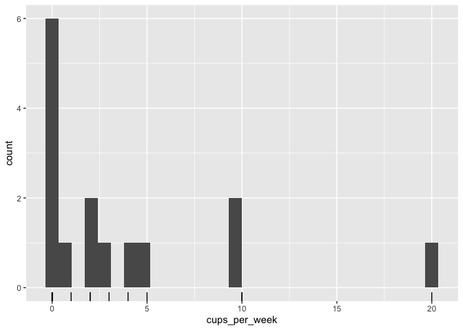

  - [Part 1: ma206data goals and
    examples](#part-1-ma206data-goals-and-examples)
      - [chap2\_Coffee example](#chap2_coffee-example)
      - [chap10\_CatJumpingFull example](#chap10_catjumpingfull-example)
      - [cd (course director) example](#cd-course-director-example)
  - [Part 2: Project management](#part-2-project-management)
  - [Part 3. All datasets listed](#part-3-all-datasets-listed)

<!-- README.md is generated from README.Rmd. Please edit that file -->

# Part 1: ma206data goals and examples

<!-- badges: start -->

<!-- badges: end -->

The goal of ma206data is to make the ‘Introduction to Statistical
Investigations, Edition II’ datasets and other course data sets quickly
accessible in R.

``` r
remotes::install_github("EvaMaeRey/ma206data")
```

## chap2\_Coffee example

``` r
library(tidyverse)
library(ma206data)
## basic example code

chap2_Coffee %>% head()
#> # A tibble: 6 × 1
#>   cups_per_week
#>           <dbl>
#> 1             0
#> 2             5
#> 3             0
#> 4             0
#> 5             2
#> 6            10


chap2_Coffee %>% 
  ggplot() +
  aes(cups_per_week) + 
  geom_rug() + 
  geom_histogram()
```



## chap10\_CatJumpingFull example

``` r
chap10_CatJumpingFull %>% 
  ggplot() + 
  aes(x = body_mass_g, 
      y = takeoff_velocity_cm_sec, 
      color = sex_0_f_1_m) + 
  geom_point()
```


## cd (course director) example

tbd.

# Part 2: Project management

Most of the action happens in the data-raw folder scripts and folders.

``` r
fs::dir_ls("data-raw/")
#> data-raw/01_scrape_isi_ed2.R
#> data-raw/02_save_course_director_data_as_rda_for_package.R
#> data-raw/02_save_isi_data_as_rda_for_package.R
#> data-raw/03_write_dataset_minimal_documentation.R
#> data-raw/course_director_data
#> data-raw/isi_txt_data
```

1.  Gathering data:

<!-- end list -->

  - The folder
    [**data-raw/course\_director\_data**](https://github.com/EvaMaeRey/ma206data/tree/master/data-raw/course_director_data)
    is populated manually with csvs
  - The folder
    [**data-raw/isi\_txt\_data**](https://github.com/EvaMaeRey/ma206data/tree/master/data-raw/isi_txt_data)
    is populated automatically using the script
    [**data-raw/01\_scrape\_isi\_ed2.R**](https://github.com/EvaMaeRey/ma206data/blob/master/data-raw/01_scrape_isi_ed2.R)

<!-- end list -->

2.  Converting to native R format and saving to package’s ‘data’ folder
    using:

<!-- end list -->

  - [**data-raw/02\_save\_course\_director\_data\_as\_rda\_for\_package.R**](https://github.com/EvaMaeRey/ma206data/blob/master/data-raw/02_save_course_director_data_as_rda_for_package.R)
  - [**data-raw/02\_save\_isi\_data\_as\_rda\_for\_package.R**](https://github.com/EvaMaeRey/ma206data/blob/master/data-raw/02_save_isi_data_as_rda_for_package.R)

<!-- end list -->

3.  Document the datasets by running:

<!-- end list -->

  - [**data-raw/03\_write\_dataset\_minimal\_documentation.R**](https://github.com/EvaMaeRey/ma206data/blob/master/data-raw/03_write_dataset_minimal_documentation.R)
    is executed, which creates, the file
    [**data/datasets\_listed.R**](https://github.com/EvaMaeRey/ma206data/blob/master/data/datasets_listed.R)
    which documents (minimally) the datasets for the package, making
    them usable.

# Part 3. All datasets listed

``` r
data(package = "ma206data", verbose = T)$results[,"Item"]
#>   [1] "alexandria (cd_alexandria)"        "anchorage (cd_anchorage)"         
#>   [3] "chap10_AgeBMI"                     "chap10_AlcoholSmoke"              
#>   [5] "chap10_CatJumping"                 "chap10_CatJumpingFull"            
#>   [7] "chap10_DraftLottery"               "chap10_ExerciseMood"              
#>   [9] "chap10_Facebook"                   "chap10_FootHeight"                
#>  [11] "chap10_GPA"                        "chap10_HeightHaircut"             
#>  [13] "chap10_HondaAgePrice"              "chap10_MissClassGPA"              
#>  [15] "chap10_SleepGPA"                   "chap10_StroopAgeTime"             
#>  [17] "chap10_TempHeart"                  "chap10_TextbookPrices"            
#>  [19] "chap10_WeightHaircut"              "chap10_Whales"                    
#>  [21] "chap10_Wimbledon"                  "chap10_WimbledonMF"               
#>  [23] "chap10_legos"                      "chap2_Coffee"                     
#>  [25] "chap2_FemaleTemp"                  "chap2_LaughIncrease"              
#>  [27] "chap2_MaleTemp"                    "chap2_MarriageAgesDiff"           
#>  [29] "chap2_Morphing"                    "chap2_MorphingMirror"             
#>  [31] "chap2_PredictedScore"              "chap2_SleepTimes"                 
#>  [33] "chap2_SnippetEstimate"             "chap2_SnippetPopulation"          
#>  [35] "chap2_Texts"                       "chap3_AgeFirstChild"              
#>  [37] "chap3_AirDryers"                   "chap3_CollegeMidwest"             
#>  [39] "chap3_GettysburgAddress"           "chap3_Hockey"                     
#>  [41] "chap3_Hockey2"                     "chap3_MaleTemp"                   
#>  [43] "chap3_MarriageAgesDiff"            "chap3_SleepTimes"                 
#>  [45] "chap3_SnakeAge"                    "chap3_TVTime"                     
#>  [47] "chap3_TimeEstimate"                "chap3_UsedCars"                   
#>  [49] "chap5_Blood"                       "chap5_Dolphin"                    
#>  [51] "chap5_Gilbert"                     "chap5_Smoking"                    
#>  [53] "chap5_Yawning"                     "chap6_CloseFriends"               
#>  [55] "chap6_DungBeetles"                 "chap6_InhibitoryControl-2"        
#>  [57] "chap6_OldFaithful"                 "chap6_SleepDeprivation"           
#>  [59] "chap6_VideoAggression"             "chap7_AirDryers2"                 
#>  [61] "chap7_Auction"                     "chap7_DadJokes"                   
#>  [63] "chap7_FirstBase"                   "chap7_JJvsBicycle"                
#>  [65] "chap8_ActivityAging"               "chap8_Acupuncture"                
#>  [67] "chap8_Alligators"                  "chap8_Alligators2"                
#>  [69] "chap8_AlligatorsLakeGroup"         "chap8_EstimatingEnergyExpenditure"
#>  [71] "chap8_EstimatingEnergyIntake"      "chap8_FishAndCancer"              
#>  [73] "chap8_Goals"                       "chap8_HIVintervention"            
#>  [75] "chap8_HappinessIncome"             "chap8_HeartDiseaseBaldness"       
#>  [77] "chap8_MarriageViews"               "chap8_NightLight1"                
#>  [79] "chap8_NightLight2"                 "chap8_OrganDonor"                 
#>  [81] "chap8_PolitPartySurveyA"           "chap8_PolitPartySurveyB"          
#>  [83] "chap8_Rebate"                      "chap8_SexBreakfast"               
#>  [85] "chap8_SexPhoneType"                "chap8_SleepApnea"                 
#>  [87] "chap8_SocialNormsLocation"         "chap8_SocialNormsSex"             
#>  [89] "chap8_SocialNormsSpeed"            "chap8_Stop"                       
#>  [91] "chap8_Towels"                      "chap8_TreatmentRace"              
#>  [93] "chap9_Aggression"                  "chap9_Brain"                      
#>  [95] "chap9_Comprehension"               "chap9_Diets"                      
#>  [97] "chap9_Donation"                    "chap9_FlightTimes"                
#>  [99] "chap9_HeartRates"                  "chap9_Mercury"                    
#> [101] "chap9_Recall"                      "chap9_SocialMediaandSelfEsteem"   
#> [103] "chap9_VideoMood"                   "charlotte (cd_charlotte)"         
#> [105] "freethrows (cd_freethrows)"        "honolulu (cd_honolulu)"           
#> [107] "opioids (cd_opioids)"              "prelim_NationalAnthemTimes"       
#> [109] "prelim_OrganDonor"
```
